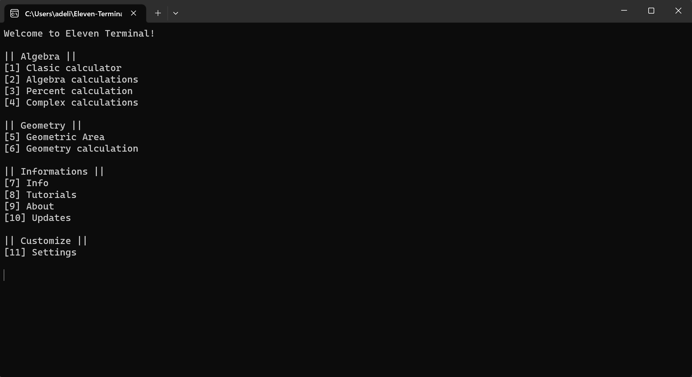
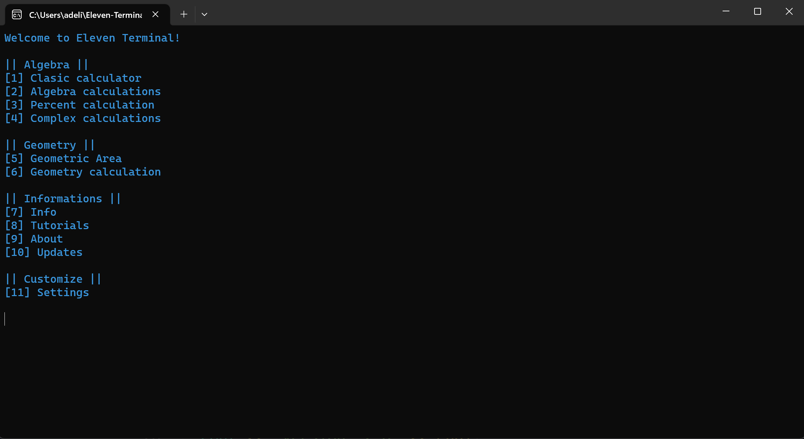

# Eleven-Terminal

 

### Eleven Terminal is a terminal calculator used to simplify the calculation.\
### Eleven Terminal have a lot of functionality easy to use and 100% free.
# Features

- The areas of geometric figures

- Geometric calculations

- Algebraic calculations

- Complex calculations

- G++ project

- Menu configure & Color configure

- Current date display

- Random building ID generator

- In app commands & code

# Docs

For: [Commands](https://github.com/HojdaAdelin/Eleven-Terminal/blob/master/doc/COMMANDS.md)

For: [Modification](https://github.com/HojdaAdelin/Eleven-Terminal/blob/master/doc/MODIFICATIONS.md)

For: [Config](https://github.com/HojdaAdelin/Eleven-Terminal/blob/master/doc/CONFIG.md)

# Algebraic & geometric calculations

If people think these calculations are dificult, for this app isn't.\
This app can calculate anything.\
All surface of the geometric figures are included, that means you no longer need to calculate manually.\
Also for algebraic calculations you no longer need to calculate manually.

# G++ guide

This project is builded by g++ tool in VS Code.

Learn more:\
[G++ guide](https://code.visualstudio.com/docs/cpp/config-mingw)\
[VS Code](https://code.visualstudio.com/)

### If the icon.res is not recognized while build the app
### Run the code from Builder/icon.txt in terminal and try build again 

# Other tehnic to build the app

G++ isn't the only way to build this project.\
If you don't understand this tool you can learn from [Project doc](https://github.com/HojdaAdelin/Eleven-Terminal/blob/master/doc/BUILD.md)

# In app commands

1. exit -> exit the application
2. dev -> open dev menu
3. clear -> clear the terminal
4. help -> help center
In dev menu you can view the code behind this app

# Configure feature

To make more easier this app to be customized I add a small config feature.\
This concept use [Fstream library](https://cplusplus.com/reference/fstream/fstream/) that manage the config.

There is 2 part of the concept:\
-write data\
-read data

# Date display & ID generator

**Date display** work like a timezone.\
This feature display the current date of the user.

**ID generator** is a feature that create a random string of caracters to describe the ID & Serial build procces.

# Terminal Menu

Default:

 

Colored:

 

